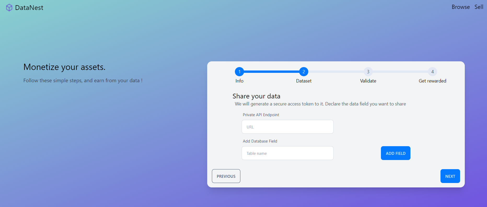

# Datanest

Datanest is an web3 project made during the first edition of the [PBWS](https://www.pbwsummit.com/) Hackathon in Paris, 2022.


Datanest is a marketplace for enterprise to monetize their dataset, selling decentralized access to their data throught usage of an NFT (Contract sample code on another github)


You can find here the front part, simulating what the full project would look like.



## Usage
To launch project locally, run

```
npm install
npm run dev
```

and then head to http://localhost:3000/

## Framework

This project uses :
- [Vue.js 3](https://vuejs.org/guide/quick-start.html#with-build-tools) + Vite.
- [Tailwind CSS](https://tailwindcss.com/)
- [DaisyUI](https://daisyui.com/)

